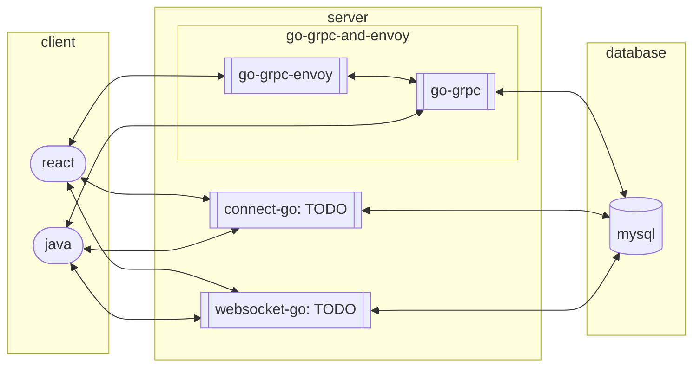

# application-interface-sample

### application port
|    name                                      | port | type     | 
|--------------                                |----- | ----     |
|[client-react](./client-react)                | 9100 | client   |
|[client-java](./client-java)                  | 9101 | client   |
|[server-go-grpc](./server-go-grpc)            | 9140 | server   |
|[server-go-grpc-envoy](./server-go-grpc-envoy)| 9141 | server   |
|[database-mysql](./database-mysql)            | 9190 | database |

### server-roadmap
|  language  | grpc | connect | websocket | graphql | openapi(rest) | quic |
|--          | --- | ----    |        -- | --      | --            | --   |
| go         | [server-go-grpc](./server-go-grpc) | TODO    | TODO | TODO | TODO            | TODO   |
| java         | TODO | TODO    | TODO | TODO | TODO            | TODO   |
| kotlin         | TODO | TODO    | TODO | TODO | TODO            | TODO   |
| rust         | TODO | TODO    | TODO | TODO | TODO            | TODO   |


### architecture



### client start
```shell
docker-compose -f docker-compose-application-client.yml build --no-cache --progress plain && docker-compose -f docker-compose-application-client.yml up
```

### server start
```shell
docker-compose -f docker-compose-application-server.yml build --no-cache --progress plain && docker-compose -f docker-compose-application-server.yml up
```

### generate command
```shell
docker-compose -f docker-compose-generate-interface.yml build --no-cache --progress plain && docker-compose -f docker-compose-generate-interface.yml up 
```

### env set (if you want to run application without docker)
```shell
export `cat .env | awk '{print $1}' | xargs`
```
